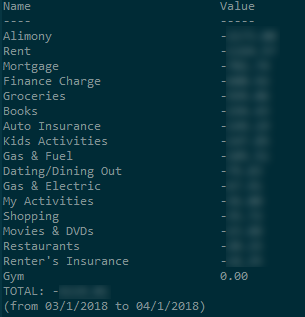
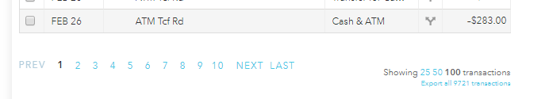

The advatage of using this over Mint's reports are that Mint reports don't show subcategories or allow you to filter out categories.
Optional parameters: 
 -startDate 1/1/2001
 -file "c:\path\to\.csv"
 
 Example output:
 
 
 
 To export transactions in Mint click the "Export all ## transactions" link at the bottom of the transactions page.
 
  
  
  Or click this link when you are logged in:
  [Export Mint Transactions](https://mint.intuit.com/transactionDownload.event?queryNew=&offset=0&filterType=cash&comparableType=8)
